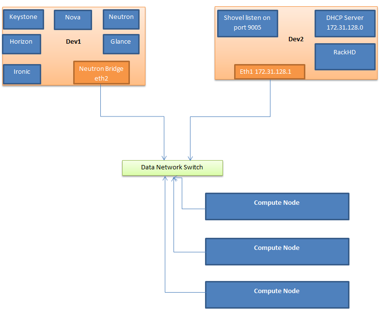
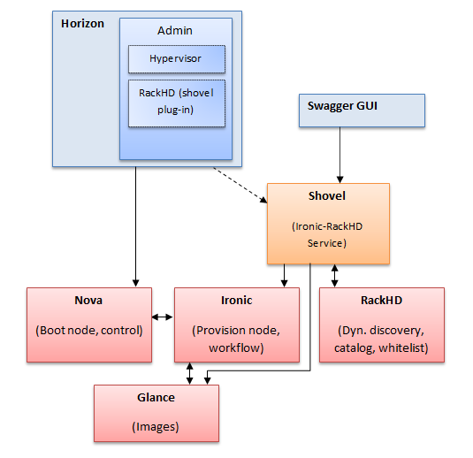

# Shovel(RackHD/OpenStack Coordinator)

## Description
Shovel is an application that provides a service with a set of APIs that wraps around RackHD/Ironic existing APIs allowing users to find Baremetal Compute nodes dynamically  discovered by RackHD and register/unregister them with Ironic (OpenStack Bare Metal Provisioning Program).Shovel also provides poller service that monitors compute nodes and logs the errors from SEL into Ironic Database.

A Shovel Horizon plugin is also provided to interface with the Shovel service. The plugin adds a new Panel to the admin Dashboard called rackhd that displays a table of all the Baremetal systems discovered by RackHD. It also allows the user to see the node catalog in a nice table View, Register/Unregister node in Ironic, display node SEL and enable/register a failover node.

## Demo

## Instructions
-  Use [RackHD: Quick Setup](http://rackhd.readthedocs.org/en/latest/getting_started.html) to install  [RackHD](https://github.com/RackHD/RackHD).
- Use Devstack to [Deploy Openstack](http://docs.openstack.org/developer/ironic/dev/dev-quickstart.html#deploying-ironic-with-devstack) to a single machine.
- Shovel-Horizon consists of two repositories:
  - Service Application called Shovel, serves as [RackHD](https://github.com/RackHD/RackHD)/[Ironic](https://wiki.openstack.org/wiki/Ironic) coordinator (Readme [Instructions](shovel_instructions.md) to setup the service). 
  - [Shovel Horizon](https://github.com/keedya/shovel-horizon-plugin) Plug-in ( [Instructions](https://github.com/keedya/shovel-horizon-plugin/blob/master/README.md) to Deploy plug-in to Horizon interface).

### System level Diagram

### Services Diagram

## Licensing

## Support
Please file bugs and issues at [Launchpad Sovel page](https://launchpad.net/shovel).
